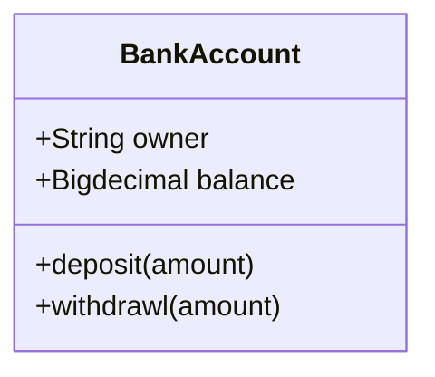
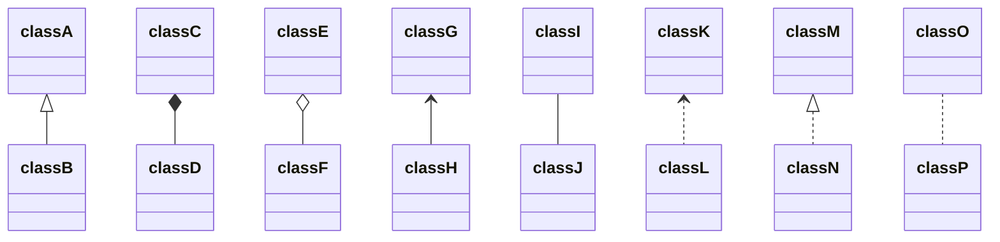
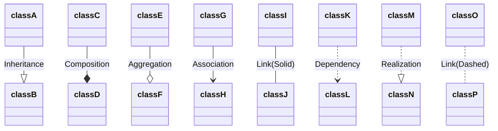
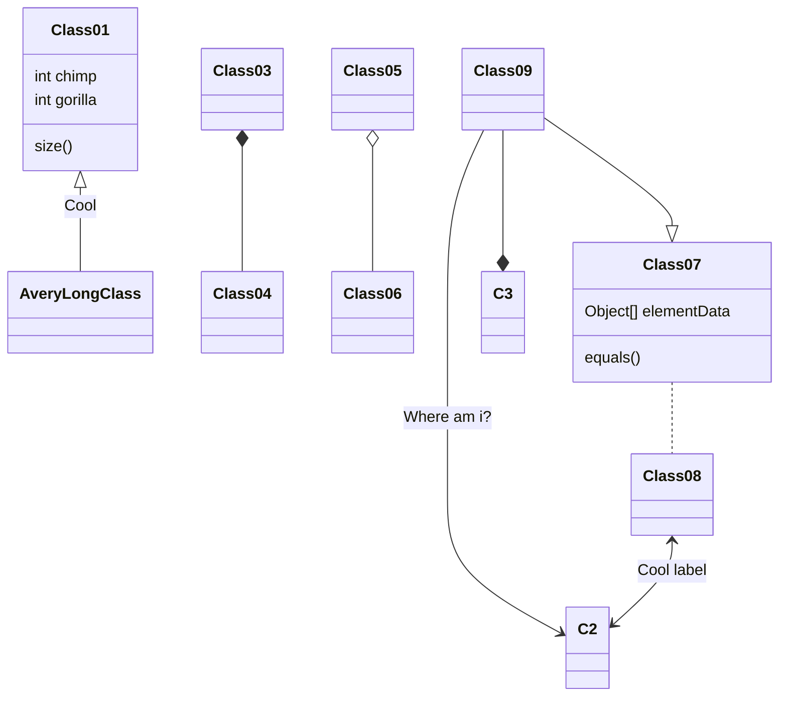

# Class diagrams

## 基本構文

| Class の名前 |
| --- |
| クラスの属性 |
| クラスの操作() |

Mermaid では　**(　)** が付いていないものを **属性** 、付いているものを **メソッド/関数** として扱われる

```
classDiagram
    class BankAccount
    BankAccount : +String owner
    BankAccount : +Bigdecimal balance
    BankAccount : +deposit(amount)
    BankAccount : +withdrawl(amount)
```



## 矢印の種類

矢印の種類を変えることも出来る

```
classDiagram
classA <|-- classB
classC *-- classD
classE o-- classF
classG <-- classH
classI -- classJ
classK <.. classL
classM <|.. classN
classO .. classP
```



## ラベル

矢印の中にラベルを表示させることも出来る

```
classDiagram
classA --|> classB : Inheritance
classC --* classD : Composition
classE --o classF : Aggregation
classG --> classH : Association
classI -- classJ : Link(Solid)
classK ..> classL : Dependency
classM ..|> classN : Realization
classO .. classP : Link(Dashed)
```



##　　応用

```
classDiagram
Class01 <|-- AveryLongClass : Cool
Class03 *-- Class04
Class05 o-- Class06
Class07 .. Class08
Class09 --> C2 : Where am i?
Class09 --* C3
Class09 --|> Class07
Class07 : equals()
Class07 : Object[] elementData
Class01 : size()
Class01 : int chimp
Class01 : int gorilla
Class08 <--> C2: Cool label
```


