# Flowcharts


## 矢印の向き先

左から右方向に矢印で繋ぐ

```
flowchart LR
    start --> stop
```


矢印の方向の決め方

TB - top to bottom
TD - top-down/ same as top to bottom
BT - bottom to top
RL - right to left
LR - left to right

例) 上から下

```
flowchart TB
    start --> stop
```

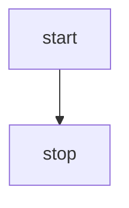

## テキストを表示させる

```
flowchart LR
    id1[hoge fuga] --> id2[fuga hoge]
```


## 形を変える

テキスト文字の囲い方を変えると形が変わる。直感的で分かりやすい。

```
flowchart LR
    id1(A node with round edges)
```


---

```
flowchart LR
    id2([A stadium-shaped node])
```

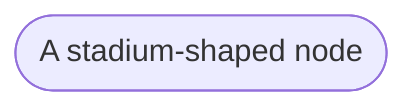

---

```
flowchart LR
    id3[[A node in a subroutine shape]]
```

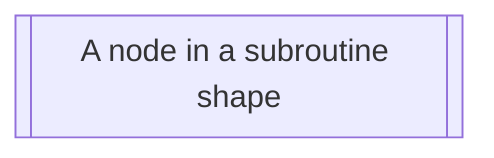

---

```
flowchart LR
    id4[(A node in a cylindrical shape)]
```

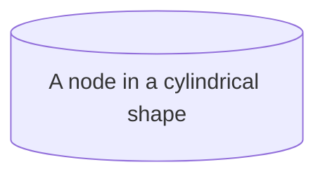

---

```
flowchart LR
    id5((A node in the form of a circle))
```

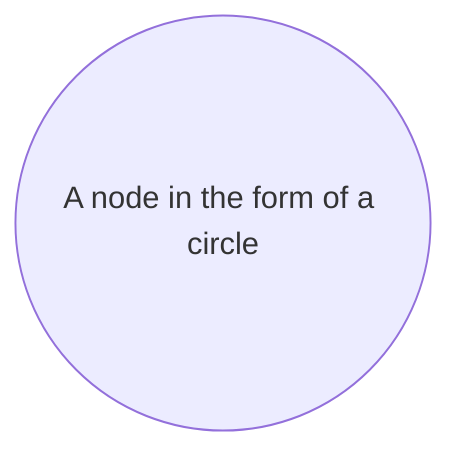

---

```
flowchart LR
    id6>A node in an asymmetric shape]
```

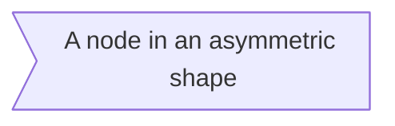

---

```
flowchart LR
    id7{A node rhombus}
```

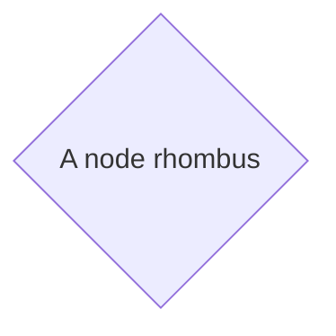

---

```
flowchart LR
    id8{{A hexagon node}}
```


---

```
flowchart LR
    id9[/Parallelogram/]
```

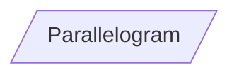

---

```
flowchart LR
    id10[/Parallelogram alt\]
```

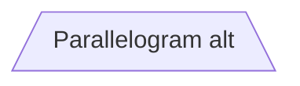

---

```
flowchart LR
    id11[/Trapezoid\]
```

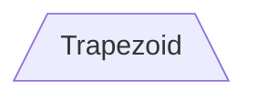

---

```
flowchart LR
    id12[\Trapezoid alt/]
```

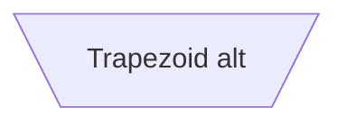

## 矢印の中にテキストを埋め込む

```
flowchart LR
   A -- text --> B -- text2 --> C
```

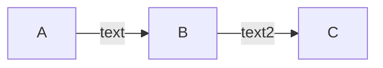

## 応用

```
flowchart TD
    A[Start] --> B{Is it?}
    B -- Yes --> C[OK]
    C --> D[Rethink]
    D --> B
    B -- No ----> E[End]
```

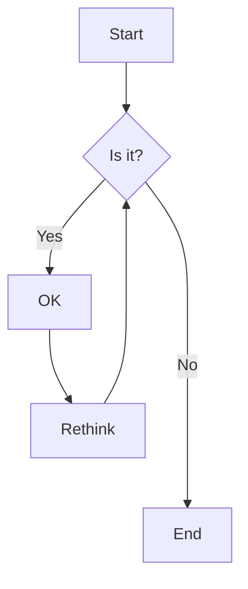

---

```
flowchart LR
    A[Hard edge] -->|Link text| B(Round edge)
    B --> C{Decision}
    C -->|One| D[Result one]
    C -->|Two| E[Result two]
```

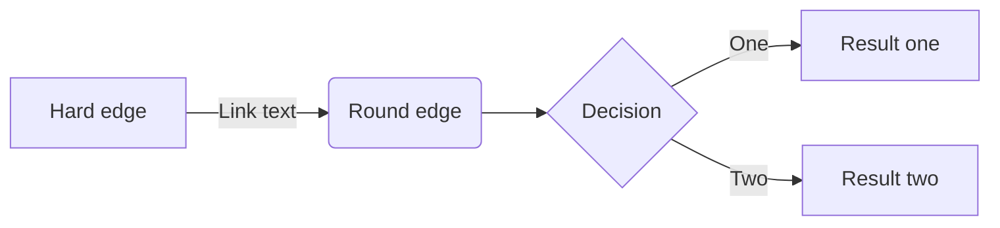
