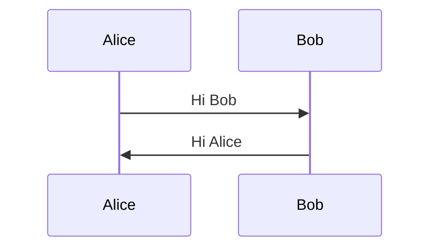
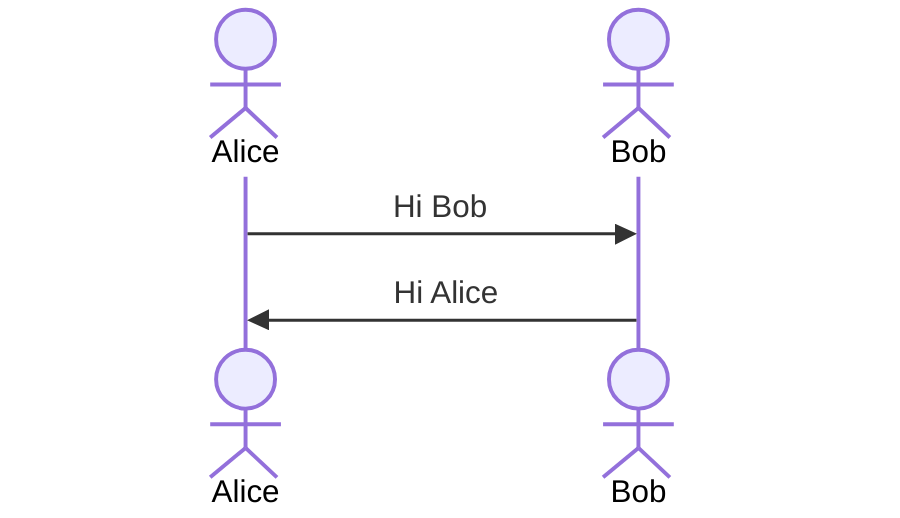
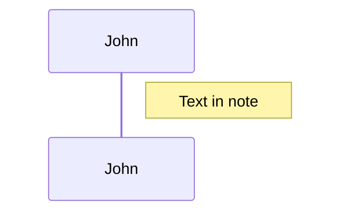
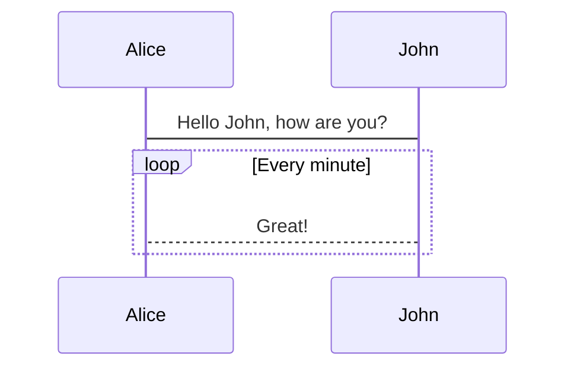
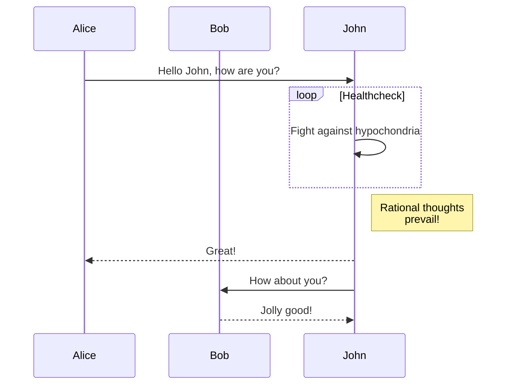

# Sequence diagrams

## 基本構文

始点 -矢印の種類- 終点 の順に記載

```
sequenceDiagram
    participant Alice
    participant Bob
    Alice->>Bob: Hi Bob
    Bob->>Alice: Hi Alice
```



## 形を変える

`actor` と書くと人の形に変えられる

```
sequenceDiagram
    actor Alice
    actor Bob
    Alice->>Bob: Hi Bob
    Bob->>Alice: Hi Alice
```



## ノート

図の間にノートを書くことも出来る

```
sequenceDiagram
    participant John
    Note right of John: Text in note
```



## ループ

```
sequenceDiagram
    Alice->John: Hello John, how are you?
    loop Every minute
        John-->Alice: Great!
    end
```



## 応用

```
sequenceDiagram
    participant Alice
    participant Bob
    participant John
    Alice->>John: Hello John, how are you?
    loop Healthcheck
        John->>John: Fight against hypochondria
    end
    Note right of John: Rational thoughts <br/>prevail!
    John-->>Alice: Great!
    John->>Bob: How about you?
    Bob-->>John: Jolly good!
```

