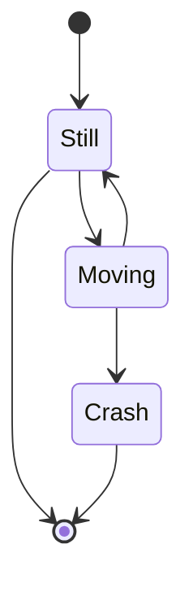
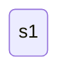
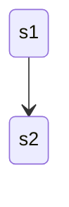
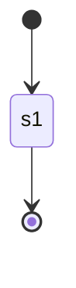
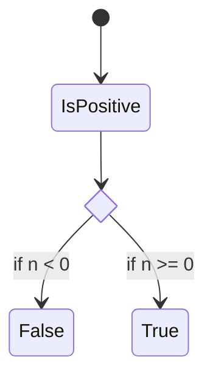
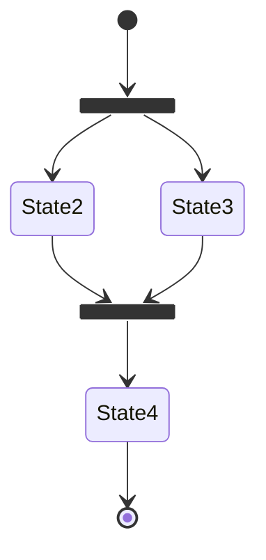

# State diagrams



## 基本構文

一番単純な形はフローチャートの時とほぼ一緒

```
stateDiagram-v2
    s1
```



## 状態遷移

矢印で繋ぐ

```
stateDiagram-v2
    s1 --> s2
```



## 始点と終点

始点と終点はそれぞれ `[*]` で表す

```
stateDiagram-v2
    [*] --> s1
    s1 --> [*]
```



## 分岐

`<<choice>>` を使用すると if 文を描画することが出来る

```
stateDiagram-v2
    state if_state <<choice>>
    [*] --> IsPositive
    IsPositive --> if_state
    if_state --> False: if n < 0
    if_state --> True : if n >= 0
```



## フォーク

フォークの開始を `<<fork>>` 、終わりを `<<join>>` と記載することで以下のような描画が可能

```
   stateDiagram-v2
    state fork_state <<fork>>
      [*] --> fork_state
      fork_state --> State2
      fork_state --> State3

      state join_state <<join>>
      State2 --> join_state
      State3 --> join_state
      join_state --> State4
      State4 --> [*]
```

